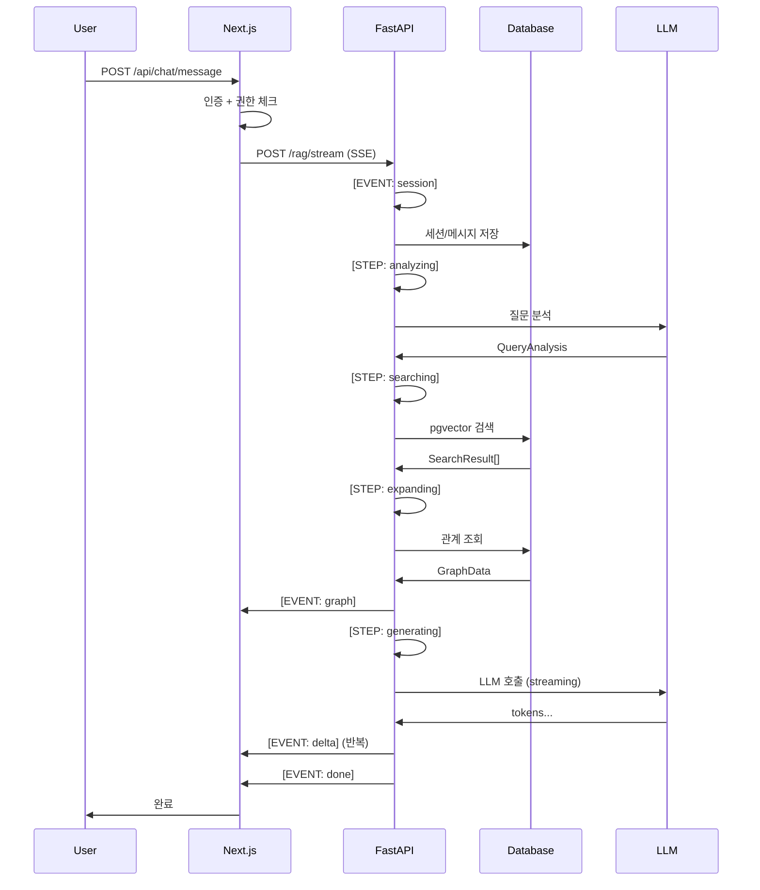

# factagora-graph-sdk

Factagora 그래프 기반 지식 탐색 SDK - 모노레포

RAG(Retrieval-Augmented Generation) 챗봇을 위한 완전한 타입스크립트 SDK입니다. SSE 기반 실시간 스트리밍, 그래프/타임라인 시각화, DG(Document Graph) 및 TKG(Temporal Knowledge Graph) 지원을 제공합니다.

## 📦 Packages

- **[@factagora/types](./packages/types)** - 공유 TypeScript 타입 (Graph, Timeline, SSE, Chat, Agent)
- **[@factagora/chat-sdk](./packages/chat-sdk)** - RAG 챗봇 SDK (React hooks + Web API)
- **[@factagora/chatbot-viz](./packages/viz)** - 그래프/타임라인 시각화 컴포넌트

## 🚀 Quick Start

```bash
# 의존성 설치
pnpm install

# 모든 패키지 빌드
pnpm build

# 개발 모드
pnpm dev
```

## 🏗️ Tech Stack

- **모노레포**: Turborepo + pnpm workspaces
- **타입 시스템**: TypeScript 5.9+
- **빌드**: tsup (esbuild 기반)
- **패키지 레지스트리**: GitHub Packages
- **시각화**: react-force-graph-2d, @xyflow/react, vis-timeline
- **상태 관리**: Zustand

## 📁 프로젝트 구조

```
factagora-graph-sdk/
├── packages/
│   ├── types/              # @factagora/types
│   │   └── src/
│   │       ├── graph.ts         # GraphData, GraphNode, GraphMetadata
│   │       ├── timeline.ts      # TimelineData, TimelineItem
│   │       ├── sse.ts          # SSE 이벤트 타입 (9가지)
│   │       ├── chat.ts         # ChatMessage, ChatSession
│   │       ├── enums.ts        # SearchMode, QueryType, StreamingStatus
│   │       └── agent.ts        # Agent 통합 타입
│   │
│   ├── chat-sdk/           # @factagora/chat-sdk
│   │   └── src/
│   │       ├── hooks/
│   │       │   ├── useChat.ts          # 메인 채팅 훅
│   │       │   └── useSessionList.ts   # 세션 목록 훅
│   │       └── client/
│   │           ├── sseClient.ts        # streamSSE async generator
│   │           ├── sseParser.ts        # parseSSEChunk 파서
│   │           └── chatApiClient.ts    # REST API 클라이언트
│   │
│   └── viz/                # @factagora/chatbot-viz
│       └── src/
│           ├── graph/
│           │   ├── GraphPanel.tsx           # DG/TKG 자동 분기
│           │   ├── ForceGraph.tsx          # TKG 멀티홉 (Canvas)
│           │   ├── TreeGraph.tsx           # DG 트리 (XYFlow)
│           │   ├── TreeGraphNode.tsx       # XYFlow 노드
│           │   ├── NodeDetailPanel.tsx     # 노드 상세
│           │   ├── tkgGraphStyles.ts       # TKG 색상/크기
│           │   └── layoutUtils.ts          # dagre 레이아웃
│           └── timeline/
│               ├── TimelinePanel.tsx        # 타임라인 컨테이너
│               ├── TimelineChart.tsx        # vis-timeline
│               └── RelationDetailDrawer.tsx # 관계 상세
│
├── tooling/
│   └── tsconfig/           # 공유 TypeScript 설정
└── .github/
    └── workflows/          # CI/CD
```

---

# 📖 패키지 상세 가이드

## @factagora/types

### 개요

모든 Factagora 시스템에서 공유하는 TypeScript 타입 정의를 제공합니다. 백엔드 API, 프론트엔드, Chrome Extension에서 공통으로 사용할 수 있도록 설계되었습니다.

### 설치

```bash
pnpm add @factagora/types
```

### 주요 타입

#### 1. GraphData & GraphNode

그래프 데이터 구조입니다. DG(Document Graph)와 TKG(Temporal Knowledge Graph) 모두를 지원합니다.

```typescript
import type { GraphData, GraphNode, GraphEdge, GraphMetadata } from '@factagora/types'

interface GraphData {
  nodes: GraphNode[]
  edges: GraphEdge[]
  metadata: GraphMetadata | null
}

interface GraphNode {
  id: string                              // 노드 고유 ID
  label: string                           // 표시명
  type: string                            // 노드 타입 (fact, condition, procedure, drug 등)
  confidence: number | null               // 신뢰도 (0.0~1.0)
  isDirectMatch: boolean                  // 직접 검색 매칭 여부
  content: string | null                  // 상세 내용
  sources: string[]                       // 출처 URL 목록
  tags: string[]                          // 태그
  metadata: TKGNodeMetadata | null        // TKG 메타데이터
  validationCreatedAt: string | null      // 검증 시작 (ISO 8601)
  validationEndedAt: string | null        // 검증 종료 (ISO 8601)
}

interface GraphEdge {
  source: string                          // 소스 노드 ID
  target: string                          // 타겟 노드 ID
  relationship: string                    // 관계 타입 (parent_of, supports 등)
  weight: number | null                   // 엣지 가중치
}
```

**DG(Document Graph) 메타데이터**

```typescript
interface DGGraphMetadata {
  expansionDepth: number                  // 그래프 확장 깊이 (1-hop 등)
  totalNodes: number
  directMatchCount: number                // retrieval 결과
  expandedCount: number                   // graph expansion 결과
  allowedRelationshipTypes: string[]
}
```

**TKG(Temporal Knowledge Graph) 메타데이터**

```typescript
interface TKGNodeMetadata {
  hopDistance: number                     // 0=seed, 1=1-hop, 2=2-hop
  isDiscoveryNode: boolean                // 신규 발견 노드 여부
  similarity: number | null               // 벡터 유사도 (seed 노드만)
  pathConfidence: number                  // 경로 누적 신뢰도 (0.0~1.0)
  validPeriodStart?: string | null
  validPeriodEnd?: string | null
}

interface TKGGraphMetadata {
  graphType: 'multihop_tkg'
  totalNodes: number
  totalEdges: number
  hopDistribution: Record<string, number> // 예: {"0": 5, "1": 10, "2": 3}
  discoveryCount: number
  maxHopsUsed: number
  maxHopsConfig: number
  maxNodesConfig: number
  avgPathConfidence: number
}
```

**타입 가드 함수**

```typescript
import { isTKGGraphMetadata } from '@factagora/types'

if (isTKGGraphMetadata(graphData.metadata)) {
  // TKG 그래프 처리
  console.log('Discovery nodes:', graphData.metadata.discoveryCount)
} else {
  // DG 그래프 처리
  console.log('Expansion depth:', graphData.metadata?.expansionDepth)
}
```

#### 2. TimelineData & TimelineItem

타임라인 데이터 구조입니다. TKG 모드에서 시간축 관계를 시각화하는 데 사용됩니다.

```typescript
import type { TimelineData, TimelineItem, TimelineGroup } from '@factagora/types'

interface TimelineData {
  items: TimelineItem[]                   // relation 목록
  groups: TimelineGroup[]                 // entity 목록
  metadata: TimelineMetadata | null
}

interface TimelineItem {
  id: string
  content: string                         // 표시 텍스트
  group: string                           // entity ID (그룹)
  start: string                           // ISO 8601
  end: string | null                      // null = 현재 진행형
  title: string | null                    // 툴팁
  className: string | null                // 스타일 CSS
  data: TimelineItemData | null           // relation 상세 정보
}

interface TimelineItemData {
  relType: string                         // 예: "진단", "처방", "검사"
  confidence: number                      // 0.0~1.0
  subjectName: string
  objectName: string
  objectCanonicalId: string
  factblockIds: string[]                  // 지지 factblock ID 목록
}

interface TimelineGroup {
  id: string                              // entity ID
  content: string                         // entity 이름
  title: string | null
  data: TimelineGroupData | null
}

interface TimelineMetadata {
  entityCount: number
  relationCount: number                   // 표시된 relation 수
  totalRelationsFound: number             // 필터링 전
  relationsWithoutPeriod: number
}
```

#### 3. SSE 이벤트 타입 (9가지)

Server-Sent Events 통신을 위한 이벤트 타입입니다.

```typescript
import type {
  SSEEventType,
  ParsedSSEEvent,
  SSESessionEvent,
  SSEStatusEvent,
  SSERetrievalEvent,
  SSEDeltaEvent,
  SSEGraphEvent,
  SSETimelineEvent,
  SSEFollowUpEvent,
  SSEDoneEvent,
  SSEErrorEvent,
} from '@factagora/types'

type SSEEventType =
  | 'session'      // 세션 생성
  | 'status'       // 파이프라인 진행 상태
  | 'retrieval'    // 검색 진단 정보
  | 'delta'        // LLM 응답 토큰 (스트리밍)
  | 'graph'        // DG/TKG 그래프 데이터
  | 'timeline'     // TKG 타임라인 데이터
  | 'follow_up'    // 추천 질문
  | 'done'         // 스트리밍 완료 신호
  | 'error'        // 에러
```

**각 이벤트 타입별 데이터**

```typescript
// 세션 생성
interface SSESessionEvent {
  sessionId: string
  isNew: boolean
  collectionTitle?: string | null
}

// 진행 상태
interface SSEStatusEvent {
  step: 'analyzing' | 'searching' | 'expanding' | 'generating'
  message: string
}

// 검색 진단
interface SSERetrievalEvent {
  rawCount: number                        // 벡터 검색 원본 결과 수
  rankedCount: number                     // 재순위화 후 결과 수
  threshold: number                       // 유사도 임계값
  topSimilarity: number
  diagnosis: string | null                // 검색 실패 이유 등
}

// LLM 토큰
interface SSEDeltaEvent {
  content: string
}

// 그래프 데이터
interface SSEGraphEvent {
  graph: GraphData
}

// 타임라인 데이터
interface SSETimelineEvent {
  timeline: TimelineData
}

// 추천 질문
interface SSEFollowUpEvent {
  questions: string[]
}

// 완료 신호
interface SSEDoneEvent {
  messageId: string                       // DB 저장용
  model: string                           // 사용된 모델
  requestId: string                       // 추적용
  searchMode: 'dg' | 'tkg'
}

// 에러
interface SSEErrorEvent {
  message: string
  code: string
  retriable?: boolean
}
```

**파싱된 이벤트 (Discriminated Union)**

```typescript
type ParsedSSEEvent =
  | { type: 'session'; data: SSESessionEvent }
  | { type: 'status'; data: SSEStatusEvent }
  | { type: 'retrieval'; data: SSERetrievalEvent }
  | { type: 'delta'; data: SSEDeltaEvent }
  | { type: 'graph'; data: SSEGraphEvent }
  | { type: 'timeline'; data: SSETimelineEvent }
  | { type: 'follow_up'; data: SSEFollowUpEvent }
  | { type: 'done'; data: SSEDoneEvent }
  | { type: 'error'; data: SSEErrorEvent }
```

#### 4. ChatMessage & ChatSession

채팅 메시지 및 세션 타입입니다.

```typescript
import type { ChatSession, ChatMessage, ChatRequest } from '@factagora/types'

interface ChatSession {
  id: string
  collectionId: string | null             // null = Global Chat
  collectionTitle?: string | null
  userId: string
  title: string | null
  createdAt: string                       // ISO 8601
  updatedAt: string
  isDeleted: boolean                      // soft delete
}

interface ChatMessage {
  id: string
  sessionId: string
  role: 'user' | 'assistant'
  content: string
  requestId?: string                      // 추적용
  retrievalGraph?: GraphData              // assistant 메시지만
  retrievalTimeline?: TimelineData        // TKG 모드만
  modelUsed?: string
  queryType?: 'factual' | 'analytical' | 'temporal'
  followUpQuestions?: string[]
  userFeedback?: 'positive' | 'negative' | null
  feedbackComment?: string
  isCollectionBased?: boolean             // retrieval SSE 이벤트 수신 여부
  createdAt: string
}

interface ChatRequest {
  userId: string
  sessionId?: string | null               // null = 새 세션 생성
  collectionId?: string | null            // null = Global Chat
  message: string
  model?: string                          // 기본값: gpt-4.1-mini
  searchMode?: 'dg' | 'tkg'               // 기본값: dg
}
```

#### 5. Enum 타입

```typescript
import type { SearchMode, QueryType, FactBlockType, StreamingStatus } from '@factagora/types'

type SearchMode = 'dg' | 'tkg'

type QueryType = 'factual' | 'analytical' | 'temporal'

type FactBlockType =
  | 'fact' | 'prediction' | 'analysis' | 'opinion'  // 일반 도메인
  | 'condition' | 'procedure' | 'drug'               // 의료 도메인 (FHIR)
  | 'measurement' | 'visit'
  | 'unknown'

type StreamingStatus =
  | 'idle'
  | 'analyzing'                          // 질문 분석 중
  | 'searching'                          // 검색 중
  | 'expanding'                          // 그래프 확장 중
  | 'generating'                         // 응답 생성 중
```

#### 6. Agent 통합 타입

멀티 에이전트 시스템을 위한 표준화된 타입입니다.

```typescript
import type { AgentOutput, AgentMetadata, AgentAdapter, AgentRegistry } from '@factagora/types'

interface AgentOutput {
  graph: GraphData | null
  timeline: TimelineData | null
  content: string                         // 텍스트 응답 (필수)
  agentMeta: AgentMetadata
}

interface AgentMetadata {
  agentId: string                         // 'factagora_rag', 'chatgpt' 등
  agentType: 'factagora_rag' | 'external'
  model?: string                          // 'gpt-4.1-mini', 'claude-sonnet-4-5' 등
  searchMode?: 'dg' | 'tkg'               // Factagora RAG 전용
}

interface AgentAdapter {
  agentId: string
  toStandardOutput(rawOutput: unknown): AgentOutput
}

interface AgentRegistry {
  adapters: Record<string, AgentAdapter>
  register(adapter: AgentAdapter): void
  get(agentId: string): AgentAdapter | undefined
  list(): string[]
}
```

---

## @factagora/chat-sdk

### 개요

RAG 챗봇의 메인 훅과 SSE 클라이언트를 제공합니다. React 독립적으로 설계되어 React, Node.js, Service Worker, Chrome Extension 등 다양한 환경에서 사용 가능합니다.

### 설치

```bash
pnpm add @factagora/chat-sdk @factagora/types
```

### useChat 훅

#### Props 인터페이스

```typescript
import { useChat } from '@factagora/chat-sdk'
import type { SearchMode } from '@factagora/types'

interface UseChatOptions {
  collectionId: string | null             // 필수

  sessionId?: string | null               // 기존 세션 이어가기
  searchMode?: SearchMode                 // 기본값: 'dg'
  streamUrl?: string                      // 기본값: '/api/chat/message'
  apiBaseUrl?: string                     // 기본값: '' (relative URL)
  headers?: Record<string, string>        // 인증 토큰 등

  // 콜백
  onSessionCreated?: (sessionId: string) => void
  onStreamComplete?: () => void
  onError?: (error: Error) => void
}
```

#### 반환값 인터페이스

```typescript
interface UseChatReturn {
  // 상태
  messages: ChatMessage[]
  isStreaming: boolean
  isCollectionBased: boolean              // retrieval 이벤트 수신 여부
  status: StreamingStatus
  statusMessage: string
  partialContent: string                  // 부분 응답
  graphData: GraphData | null
  timelineData: TimelineData | null
  followUpQuestions: string[]
  sessionId: string | null
  error: Error | null
  currentSearchMode: SearchMode

  // 메서드
  sendMessage(content: string, model?: string, searchMode?: SearchMode): Promise<void>
  cancelStream(): void
  loadSession(sessionId: string, existingMessages: ChatMessage[]): void
  resetChat(): void
}
```

#### 사용 예시

```typescript
'use client'

import { useChat } from '@factagora/chat-sdk'

export function ChatComponent() {
  const {
    messages,
    isStreaming,
    partialContent,
    status,
    statusMessage,
    graphData,
    timelineData,
    followUpQuestions,
    sendMessage,
    cancelStream,
    resetChat,
  } = useChat({
    collectionId: 'col-123',
    sessionId: null,
    searchMode: 'dg',
    apiBaseUrl: 'https://api.factagora.com',
    headers: { 'Authorization': 'Bearer token' },
    onSessionCreated: (sessionId) => console.log('New session:', sessionId),
    onStreamComplete: () => console.log('Stream done'),
    onError: (error) => console.error('Chat error:', error),
  })

  return (
    <>
      {/* 상태 표시 */}
      {isStreaming && (
        <div className="status">
          {status} - {statusMessage}
        </div>
      )}

      {/* 메시지 목록 */}
      <div className="messages">
        {messages.map(msg => (
          <div key={msg.id} className={msg.role}>
            {msg.role === 'user' ? 'You: ' : 'Assistant: '}
            {msg.content}
          </div>
        ))}
        {isStreaming && <div className="assistant">Assistant: {partialContent}</div>}
      </div>

      {/* 그래프 시각화 */}
      {graphData && <GraphPanel graphData={graphData} />}

      {/* 타임라인 시각화 */}
      {timelineData && <TimelinePanel timelineData={timelineData} />}

      {/* 후속 질문 */}
      {!isStreaming && followUpQuestions.length > 0 && (
        <div className="follow-up">
          {followUpQuestions.map(q => (
            <button key={q} onClick={() => sendMessage(q)}>{q}</button>
          ))}
        </div>
      )}

      {/* 입력창 */}
      <input
        onKeyPress={(e) => {
          if (e.key === 'Enter' && !isStreaming) {
            sendMessage(e.currentTarget.value)
            e.currentTarget.value = ''
          }
        }}
        disabled={isStreaming}
      />

      {isStreaming && <button onClick={cancelStream}>Cancel</button>}
      <button onClick={resetChat}>New Chat</button>
    </>
  )
}
```

#### sendMessage 메서드

메시지를 전송하고 SSE 스트림을 처리합니다.

```typescript
// 기본 사용
await sendMessage('삼성전자의 2024년 실적은?')

// 모델 선택
await sendMessage('삼성전자의 2024년 실적은?', 'gpt-4o')

// 검색 모드 선택
await sendMessage('삼성전자의 2024년 실적은?', 'gpt-4o-mini', 'tkg')
```

**동작 흐름**:
1. 이전 스트림 중단 (AbortController)
2. User 메시지 추가
3. FastAPI `/api/chat/message` POST 요청
4. ReadableStream 읽기
5. 이벤트별 상태 업데이트:
   - `session`: 세션 ID 저장
   - `status`: 진행 상태 업데이트
   - `retrieval`: 검색 기반 여부 설정
   - `delta`: 부분 응답 누적
   - `graph`: 그래프 데이터 저장
   - `timeline`: 타임라인 데이터 저장
   - `follow_up`: 후속 질문 저장
   - `done`: Assistant 메시지 추가
   - `error`: 에러 처리

#### 무한 루프 방지 패턴

`useChat` 내부에서 useRef와 useCallback을 사용하여 무한 루프를 방지합니다.

```typescript
// useChat 내부 구현
const sessionIdRef = useRef(sessionId)
const collectionIdRef = useRef(collectionId)
const onSessionCreatedRef = useRef(onSessionCreated)

// useEffect로 ref 동기화
useEffect(() => {
  sessionIdRef.current = sessionId
}, [sessionId])

useEffect(() => {
  collectionIdRef.current = collectionId
}, [collectionId])

useEffect(() => {
  onSessionCreatedRef.current = onSessionCreated
}, [onSessionCreated])

// sendMessage의 dependency는 [defaultSearchMode]만
const sendMessage = useCallback(
  async (content: string, model?: string, searchMode?: SearchMode) => {
    // ref로 최신값 참조 (dependency에 상태값 넣지 않음)
    const currentSessionId = sessionIdRef.current
    const currentCollectionId = collectionIdRef.current
    onSessionCreatedRef.current?.(newSessionId)
  },
  [defaultSearchMode]  // 상태값 미포함
)
```

### SSE 통신

#### streamSSE - SSE 클라이언트 (React 독립적)

async generator 패턴으로 SSE 스트림을 처리합니다.

```typescript
import { streamSSE } from '@factagora/chat-sdk'
import type { ParsedSSEEvent } from '@factagora/types'

interface SSERequestOptions {
  method?: 'GET' | 'POST'                 // 기본값: 'POST'
  headers?: Record<string, string>
  body?: unknown                          // JSON.stringify됨
  signal?: AbortSignal                    // 스트림 취소용
}

async function* streamSSE(
  url: string,
  options: SSERequestOptions = {}
): AsyncGenerator<ParsedSSEEvent, void, unknown>
```

**사용 예시**:

```typescript
const controller = new AbortController()

try {
  for await (const event of streamSSE('/api/chat/message', {
    method: 'POST',
    headers: { 'Content-Type': 'application/json' },
    body: {
      collectionId: 'col-123',
      sessionId: 'sess-456',
      message: 'Hello',
      searchMode: 'dg',
    },
    signal: controller.signal,
  })) {
    switch (event.type) {
      case 'session':
        console.log('Session created:', event.data.sessionId)
        break
      case 'status':
        console.log('Status:', event.data.step, event.data.message)
        break
      case 'delta':
        console.log('Token:', event.data.content)
        break
      case 'graph':
        console.log('Graph data:', event.data.graph)
        break
      case 'timeline':
        console.log('Timeline data:', event.data.timeline)
        break
      case 'done':
        console.log('Message ID:', event.data.messageId)
        break
      case 'error':
        console.error('Error:', event.data.message)
        break
    }
  }
} catch (error) {
  if (error.name === 'AbortError') {
    console.log('Stream cancelled')
  } else {
    console.error('Stream error:', error)
  }
}

// 취소
controller.abort()
```

#### parseSSEChunk - SSE 파서

SSE 텍스트 청크를 파싱합니다.

```typescript
import { parseSSEChunk } from '@factagora/chat-sdk'
import type { ParsedSSEEvent } from '@factagora/types'

function parseSSEChunk(buffer: string): {
  events: ParsedSSEEvent[]
  remaining: string
}
```

**특징**:
- SSE 형식 파싱: `event: type\ndata: {...}\n\n`
- 버퍼링으로 청크 분할 처리
- 순수 함수 (React 독립적)

**내부 로직**:

```typescript
// 예: SSE 버퍼가 다음과 같으면
const buffer = `event: session
data: {"sessionId":"s123","isNew":true}

event: status
data: {"step":"analyzing","message":"Analyzing query"}

`

const { events, remaining } = parseSSEChunk(buffer)
// events = [
//   { type: 'session', data: { sessionId: 's123', isNew: true } },
//   { type: 'status', data: { step: 'analyzing', message: 'Analyzing query' } }
// ]
// remaining = ''
```

### 세션 관리

#### useSessionList 훅

세션 목록을 관리합니다.

```typescript
import { useSessionList } from '@factagora/chat-sdk'

interface UseSessionListOptions {
  collectionId: string | null             // 필터링
  includeDeleted?: boolean                // 기본값: false
  autoFetch?: boolean                     // 기본값: true (자동 조회)
  apiBaseUrl?: string                     // 기본값: '' (relative URL)
  headers?: Record<string, string>
}

interface UseSessionListReturn {
  sessions: ChatSession[]
  isLoading: boolean
  error: Error | null
  fetchSessions(): Promise<void>          // 수동 조회
  deleteSession(sessionId: string): Promise<boolean>  // 낙관적 업데이트
}
```

**사용 예시**:

```typescript
const { sessions, isLoading, fetchSessions, deleteSession } = useSessionList({
  collectionId: 'col-123',
  autoFetch: true,
})

// 세션 삭제 (낙관적 업데이트)
await deleteSession('sess-456')
```

#### REST API 클라이언트

```typescript
import {
  fetchSessions,
  fetchSession,
  deleteSession,
} from '@factagora/chat-sdk'
import type { ChatSession } from '@factagora/types'

// 세션 목록 조회
async function fetchSessions(
  params: { collectionId?: string | null, includeDeleted?: boolean } = {},
  options: { baseUrl?: string, headers?: Record<string, string> } = {}
): Promise<ChatSession[]>

// 세션 상세 조회
async function fetchSession(
  sessionId: string,
  options: { baseUrl?: string, headers?: Record<string, string> } = {}
): Promise<ChatSession>

// 세션 삭제
async function deleteSession(
  sessionId: string,
  options: { baseUrl?: string, headers?: Record<string, string> } = {}
): Promise<boolean>
```

**사용 예시**:

```typescript
// Next.js (relative URL)
const sessions = await fetchSessions({ collectionId: 'col-123' })

// Chrome Extension (absolute URL)
const sessions = await fetchSessions(
  { collectionId: 'col-123' },
  { baseUrl: 'https://api.factagora.com', headers: { 'Authorization': 'Bearer token' } }
)
```

---

## @factagora/chatbot-viz

### 개요

DG/TKG 그래프, 타임라인 시각화 컴포넌트를 제공합니다. React 기반으로 Canvas(react-force-graph-2d), XYFlow(@xyflow/react), vis-timeline을 활용합니다.

### 설치

```bash
pnpm add @factagora/chatbot-viz @factagora/types
```

### GraphPanel - DG/TKG 자동 분기 컨테이너

metadata.graphType에 따라 자동으로 TreeGraph (DG) 또는 ForceGraph (TKG)를 렌더링합니다.

#### Props

```typescript
import { GraphPanel } from '@factagora/chatbot-viz/graph'
import type { GraphData, GraphNode } from '@factagora/types'

interface GraphPanelProps {
  graphData: GraphData
  labels?: GraphPanelLabels
  className?: string
  hideHeader?: boolean
  theme?: 'light' | 'dark'

  // TreeGraph props (DG)
  selectedNodeId?: string | null
  hoveredNodeId?: string | null
  onNodeSelect?: (nodeId: string) => void
  onNodeHover?: (nodeId: string | null) => void

  // ForceGraph props (TKG)
  onNodeClick?: (node: GraphNode, graphData: GraphData) => void
}

interface GraphPanelLabels {
  dgTitle?: string                        // 기본값: "Knowledge Graph"
  tkgTitle?: string                       // 기본값: "Multi-hop Graph"
  nodes?: string                          // 기본값: "nodes"
  edges?: string                          // 기본값: "edges"
}
```

#### 사용 예시

```typescript
import { GraphPanel } from '@factagora/chatbot-viz/graph'
import { useState } from 'react'

export function MyGraphPanel({ graphData }) {
  const [selectedId, setSelectedId] = useState<string | null>(null)
  const [hoveredId, setHoveredId] = useState<string | null>(null)

  return (
    <GraphPanel
      graphData={graphData}
      labels={{
        dgTitle: "Knowledge Graph",
        tkgTitle: "Multi-hop Graph",
        nodes: "nodes",
        edges: "edges"
      }}
      theme="dark"
      selectedNodeId={selectedId}
      hoveredNodeId={hoveredId}
      onNodeSelect={(id) => setSelectedId(id)}
      onNodeHover={(id) => setHoveredId(id)}
      onNodeClick={(node, data) => {
        console.log('Clicked node:', node)
        setSelectedId(node.id)
      }}
    />
  )
}
```

### ForceGraph - TKG 멀티홉 그래프

react-force-graph-2d 기반 Canvas 시각화입니다.

#### Props

```typescript
import { ForceGraph } from '@factagora/chatbot-viz/graph'
import type { GraphData, GraphNode } from '@factagora/types'

interface ForceGraphProps {
  graphData: GraphData
  theme?: 'light' | 'dark'
  onNodeClick?: (node: GraphNode, graphData: GraphData) => void
  onNodeHover?: (nodeId: string | null) => void
  hoveredNodeId?: string | null
}
```

#### 노드 색상 & 크기 (hop distance별)

```typescript
const HOP_COLORS = {
  0: '#3B82F6',   // blue-500 (seed)
  1: '#8B5CF6',   // violet-500 (1-hop)
  2: '#F59E0B',   // amber-500 (2-hop)
}

const HOP_SIZES = {
  0: 4,           // seed: 가장 큼
  1: 2.5,         // 1-hop: 중간
  2: 1.5,         // 2-hop: 작음
}

const HOP_LABELS = {
  0: 'Seed',
  1: '1-hop',
  2: '2-hop',
}
```

#### Discovery 노드 글로우

```typescript
const DISCOVERY_GLOW_COLOR = '#FFD700'   // gold
const DISCOVERY_GLOW_ALPHA = 0.3
const DISCOVERY_GLOW_BLUR = 15
```

#### 사용 예시

```typescript
import dynamic from 'next/dynamic'

// SSR 비활성화 (Canvas 기반)
const ForceGraph = dynamic(
  () => import('@factagora/chatbot-viz/graph').then(m => ({ default: m.ForceGraph })),
  { ssr: false }
)

export function MyForceGraph({ graphData }) {
  const [hoveredId, setHoveredId] = useState<string | null>(null)

  return (
    <ForceGraph
      graphData={graphData}
      theme="dark"
      onNodeClick={(node, data) => console.log('Clicked:', node)}
      onNodeHover={(id) => setHoveredId(id)}
      hoveredNodeId={hoveredId}
    />
  )
}
```

### TreeGraph - DG 트리 구조

@xyflow/react + dagre LR 레이아웃 기반입니다.

#### Props

```typescript
import { TreeGraph } from '@factagora/chatbot-viz/graph'
import type { GraphData } from '@factagora/types'

interface TreeGraphProps {
  graphData: GraphData
  selectedNodeId?: string | null
  hoveredNodeId?: string | null
  onNodeSelect?: (nodeId: string) => void
  onNodeHover?: (nodeId: string | null) => void
}
```

#### 사용 예시

```typescript
import { TreeGraph } from '@factagora/chatbot-viz/graph'
import { ReactFlowProvider } from '@xyflow/react'
import '@xyflow/react/dist/style.css'

export function MyTreeGraph({ graphData }) {
  return (
    <ReactFlowProvider>
      <TreeGraph
        graphData={graphData}
        selectedNodeId={selectedId}
        hoveredNodeId={hoveredId}
        onNodeSelect={(id) => setSelectedId(id)}
        onNodeHover={(id) => setHoveredId(id)}
      />
    </ReactFlowProvider>
  )
}
```

### TimelinePanel - 타임라인 컨테이너

vis-timeline 기반 시각화 컨테이너입니다.

#### Props

```typescript
import { TimelinePanel } from '@factagora/chatbot-viz/timeline'
import type { TimelineData, TimelineItem } from '@factagora/types'

interface TimelinePanelProps {
  timelineData: TimelineData
  labels?: TimelinePanelLabels
  className?: string
  hideHeader?: boolean
  itemColor?: string                      // 기본값: '#3b82f6'
  onItemSelect?: (item: TimelineItem, timelineData: TimelineData) => void
}

interface TimelinePanelLabels {
  title?: string                          // 기본값: "Timeline"
  stats?: string                          // 기본값: "{entities} entities · {relations} relations"
  emptyRelations?: string
  emptyRelationsDetail?: string           // "{count} relations without period"
}
```

#### 사용 예시

```typescript
import { TimelinePanel } from '@factagora/chatbot-viz/timeline'
import { useState } from 'react'

export function MyTimelinePanel({ timelineData }) {
  const [selectedItem, setSelectedItem] = useState<TimelineItem | null>(null)

  return (
    <>
      <TimelinePanel
        timelineData={timelineData}
        labels={{
          title: "Timeline",
          stats: "{entities} entities · {relations} relations",
          emptyRelations: "No timeline items available",
          emptyRelationsDetail: "{count} relations without period"
        }}
        itemColor="#3b82f6"
        onItemSelect={(item) => setSelectedItem(item)}
      />

      {selectedItem && (
        <div className="detail">
          <h3>{selectedItem.content}</h3>
          <p>Confidence: {selectedItem.data?.confidence}</p>
        </div>
      )}
    </>
  )
}
```

### TimelineChart - vis-timeline 렌더러

TimelinePanel 내부에서 사용하는 vis-timeline 래퍼입니다.

#### Props

```typescript
import { TimelineChart } from '@factagora/chatbot-viz/timeline'
import type { TimelineData, TimelineItem } from '@factagora/types'

interface TimelineChartProps {
  timelineData: TimelineData
  itemColor?: string                      // 기본값: '#3b82f6'
  onItemSelect?: (item: TimelineItem, timelineData: TimelineData) => void
}
```

#### vis-timeline 옵션

```typescript
{
  stack: true                             // 겹치지 않게 정렬
  stackSubgroups: false
  showCurrentTime: true                   // 현재 시간 표시
  groupMinHeight: 36
  zoomMin: 30일
  zoomMax: 10년
  orientation: { axis: 'top', item: 'top' }
  margin: { item: { horizontal: 2, vertical: 4 }, axis: 5 }
  tooltip: { followMouse: true }
  selectable: true
  verticalScroll: false
  horizontalScroll: false
  zoomable: true
  moveable: true
}
```

### NodeDetailPanel - 노드 상세 정보

선택된 노드의 전체 정보를 표시하는 패널입니다.

#### Props

```typescript
import { NodeDetailPanel } from '@factagora/chatbot-viz/graph'
import type { GraphNode } from '@factagora/types'

interface NodeDetailPanelProps {
  node: GraphNode
  labels?: NodeDetailPanelLabels
  onClose: () => void
  formatDate?: (date: string) => string  // 기본값: YYYY-MM-DD
}

interface NodeDetailPanelLabels {
  nodeType?: Record<string, string>      // 노드 타입 레이블 맵
  confidence?: string
  content?: string
  sources?: string
  tags?: string
  validationPeriod?: string
  directMatch?: string
  expanded?: string
  closeDetail?: string
}
```

#### 사용 예시

```typescript
import { NodeDetailPanel } from '@factagora/chatbot-viz/graph'
import { useState } from 'react'

export function MyNodeDetail({ selectedNode }) {
  if (!selectedNode) return null

  return (
    <NodeDetailPanel
      node={selectedNode}
      labels={{
        confidence: "Confidence",
        content: "Content",
        sources: "Sources",
        nodeType: {
          fact: "Fact",
          condition: "Condition",
          procedure: "Procedure",
        }
      }}
      onClose={() => setSelectedNode(null)}
      formatDate={(date) => new Date(date).toLocaleDateString()}
    />
  )
}
```

---

# 💼 사용 사례 (Use Cases)

이 SDK는 다양한 애플리케이션 환경에서 사용할 수 있도록 설계되었습니다. 각 환경별 상세한 통합 가이드는 아래 링크를 참조하세요:

## 📱 애플리케이션별 가이드

### 1. [live-article (Next.js 기본 챗봇)](./docs/live-article.md)
RAG 기반 대화형 챗봇 애플리케이션

**주요 기능:**
- SSE 스트리밍 기반 실시간 대화
- DG/TKG 그래프 시각화
- 타임라인 시각화 (TKG)
- 세션 관리 및 대화 이력

**사용 패키지:**
- `@factagora/chat-sdk` - useChat, useSessionList 훅
- `@factagora/chatbot-viz` - GraphPanel, TimelinePanel
- `@factagora/types` - TypeScript 타입

**적합한 경우:**
- 웹 기반 채팅 인터페이스가 필요한 경우
- 실시간 스트리밍 응답이 필요한 경우
- 그래프와 타임라인 시각화가 필요한 경우

---

### 2. [factagora-social-network (AI 예측 에이전트)](./docs/social-network.md)
멀티 에이전트 예측 시스템

**주요 기능:**
- 각 Agent가 독립적으로 그래프 생성
- TKG 검색 기반 예측 근거 제공
- Agent별 그래프 시각화
- Auto Fallback (DB → 웹 검색)

**사용 패키지:**
- `@factagora/types` - GraphData, TimelineData 타입
- `@factagora/chatbot-viz` - 그래프/타임라인 컴포넌트

**적합한 경우:**
- AI Agent 시스템에 지식 그래프를 통합하려는 경우
- 예측 결과의 근거를 시각적으로 제공하려는 경우
- 여러 Agent가 독립적으로 검색해야 하는 경우

---

### 3. [chrome-extension (크롬 익스텐션)](./docs/chrome-extension.md)
브라우저 확장 프로그램

**주요 기능:**
- Service Worker에서 SSE 통신
- Content Script에서 UI 렌더링
- React 선택적 사용 (시각화 컴포넌트)
- 웹 페이지 컨텍스트 통합

**사용 패키지:**
- `@factagora/chat-sdk/client` - React 독립적 API
- `@factagora/types` - TypeScript 타입
- `@factagora/chatbot-viz` (선택) - React 기반 시각화

**적합한 경우:**
- 웹 페이지에서 Factagora 검색을 제공하려는 경우
- 사이드바/팝업 형태의 채팅 인터페이스가 필요한 경우
- 브라우저 컨텍스트에서 동작해야 하는 경우

---

### 4. [chatgpt-apps (ChatGPT / GPT Actions)](./docs/chatgpt-apps.md)
ChatGPT 커스텀 GPT 통합

**주요 기능:**
- OpenAPI 스키마 기반 통합
- GPT Actions로 Factagora API 호출
- 구조화된 검색 결과 제공
- 텍스트 기반 그래프 정보 전달

**사용 패키지:**
- API 서버 필요 (Next.js API Route 등)
- `@factagora/types` (서버 사이드)

**적합한 경우:**
- ChatGPT에 지식 그래프 검색 기능을 추가하려는 경우
- OpenAPI 스키마 기반 통합이 필요한 경우
- 그래프 시각화가 아닌 텍스트 설명이 충분한 경우

---

## 🎯 선택 가이드

| 요구사항 | 추천 환경 |
|---------|----------|
| 웹 기반 실시간 채팅 | [live-article](./docs/live-article.md) |
| AI Agent 예측 시스템 | [social-network](./docs/social-network.md) |
| 브라우저 확장 기능 | [chrome-extension](./docs/chrome-extension.md) |
| ChatGPT 통합 | [chatgpt-apps](./docs/chatgpt-apps.md) |

---

# 🔄 시스템 아키텍처

## 전체 구조

Factagora 시스템은 하이브리드 아키텍처로 구성되어 있습니다:

```
┌─────────────────────────────┐
│   클라이언트 애플리케이션      │
│   (live-article / extension  │
│    / social-network / GPT)   │
└──────────────┬──────────────┘
               │
               ▼
┌─────────────────────────────────────────┐
│   애플리케이션 서버 (선택)               │
│   - 인증 / 권한 체크                     │
│   - API 프록시 (선택)                    │
│   - SSE 프록시 (선택)                    │
└──────────────┬──────────────────────────┘
               │
               ▼
┌─────────────────────────────────────────┐
│   factagora-chatbot (FastAPI)          │
│   - RAG 파이프라인                       │
│   - 검색/Reranking/LLM                  │
│   - 세션/메시지 CRUD                     │
│   - TKG 그래프 생성                      │
└──────────────┬──────────────────────────┘
               │
    ┌──────────┼──────────┐
    ▼          ▼          ▼
┌──────────┐ ┌──────────┐ ┌──────────┐
│ Supabase │ │ Azure    │ │ LLM API  │
│ PostgreSQL│ │OpenAI   │ │(GPT/    │
│ + pgvector│ │Embedding │ │Claude/  │
│          │ │          │ │Gemini)  │
└──────────┘ └──────────┘ └──────────┘
```

### 아키텍처 다이어그램

```mermaid
graph TD
    A[Client App] -->|HTTP/SSE| B[App Server (Optional)]
    B -->|Proxy| C[Factagora API]
    A -->|Direct| C
    C -->|SSE Stream| D[RAG Pipeline]
    D -->|분석| E[Query Analyzer]
    D -->|검색| F[DG/TKG Retriever]
    D -->|확장| G[Graph Expander]
    D -->|생성| H[LLM Generator]
    F -->|pgvector| I[(Supabase)]
    H -->|API| J[LLM: GPT/Claude/Gemini]
```

## 요청/응답 흐름

### 사용자 질문부터 응답까지의 전체 흐름 (DG 모드)

```
[STEP 1] 사용자 질문 입력 (Browser)
  ↓
  ChatInput 컴포넌트에서 메시지 입력
  - model: "gpt-4o-mini" (기본값, 사용자 선택 가능)
  - search_mode: "dg" (기본값, UI에서 "tkg"로 변경 가능)
  - collection_id: UUID (선택한 컬렉션)
  ↓

[STEP 2] Next.js SSE 프록시 (POST /api/chat/message)
  ├─ 인증 (requireAuth) → userId
  ├─ 요청 검증 (Zod schema)
  ├─ 컬렉션 접근 권한 체크
  │  └─ collectionService.checkCollectionChatAccess()
  └─ FastAPI로 프록시
  ↓

[STEP 3] FastAPI /rag/stream (POST 요청)
  Body: {
    user_id: string
    collection_id: string | null
    session_id: string | null
    message: string
    model: string
    search_mode: "dg" | "tkg"
  }
  ↓

[STEP 4] Rate Limiting & Stream 슬롯 체크
  ├─ Rate Limiter: 20 req/min per user
  ├─ 동시 스트리밍: 최대 1개 (per user)
  └─ 슬롯 획득 실패 → 429 Too Many Requests
  ↓

[STEP 5] SSE 이벤트 시작
  ↓

[EVENT: session] 세션 정보
  {
    "event": "session",
    "data": {"sessionId": "uuid", "isNew": true}
  }
  ✓ 세션 ID 자동 생성 (session_id가 null인 경우)
  ↓

[STEP 6] 질문 분석 (Query Analyzer)
  Step: "analyzing"
  입력: 사용자 질문 + 대화 이력 (최근 10개)
  처리: LLM (gpt-4.1-nano) 호출
  출력: QueryAnalysis {
    intent: "factual" | "analytical" | "temporal"
    time_condition: dict | None
    keywords: list[str]
  }
  ↓

[EVENT: status - analyzing]
  {
    "event": "status",
    "data": {
      "step": "analyzing",
      "message": "질문을 분석하고 있습니다..."
    }
  }
  ↓

[STEP 7] 검색 (collection_id가 있는 경우만)
  Step: "searching"

  1. 임베딩 생성
     └─ Azure OpenAI text-embedding-3-large (1024 dimensions)

  2. pgvector 유사도 검색
     SQL:
     SELECT fb.*, 1-(embedding <=> $emb) as similarity
     FROM factblocks fb
     JOIN collection_factblocks cf
     WHERE cf.collection_id = $col_id
       AND 1-(embedding <=> $emb) > 0.7
     ORDER BY similarity DESC
     LIMIT 30

  3. 시간 필터 적용 (optional)
  ↓

[EVENT: status - searching]
  {
    "event": "status",
    "data": {
      "step": "searching",
      "message": "관련 문서를 검색하고 있습니다..."
    }
  }
  ↓

[STEP 8] Re-ranking
  최종 점수 = 0.7 × similarity
              + 0.2 × trust_score
              + 0.1 × recency_score
  Top-5만 선별
  ↓

[EVENT: retrieval - 검색 진단]
  {
    "event": "retrieval",
    "data": {
      "rawCount": 30,
      "rankedCount": 5,
      "threshold": 0.7,
      "topSimilarity": 0.85
    }
  }
  ↓

[STEP 9] 그래프 확장 (Multi-hop 관계)
  Step: "expanding"

  1-hop 확장: 각 노드의 자식/부모 노드
  제한: MAX_TOTAL_NODES=40

  출력: GraphData {
    nodes: [...],
    edges: [...]
  }
  ↓

[EVENT: status - expanding]
  {
    "event": "status",
    "data": {
      "step": "expanding",
      "message": "관계망을 확장하고 있습니다..."
    }
  }
  ↓

[EVENT: graph - 멀티홉 그래프]
  {
    "event": "graph",
    "data": {
      "nodes": [...],
      "edges": [...]
    }
  }
  ↓

[STEP 10] 컨텍스트 구성
  System Prompt + 검색 결과 + 대화 이력
  ↓

[STEP 11] LLM 응답 생성 (SSE 스트리밍)
  Step: "generating"
  streaming=true로 토큰 단위 응답
  ↓

[EVENT: status - generating]
  {
    "event": "status",
    "data": {
      "step": "generating",
      "message": "답변을 생성하고 있습니다..."
    }
  }
  ↓

[EVENT: delta - 토큰 단위 스트리밍] (반복)
  {
    "event": "delta",
    "data": {"content": "삼성전자의 2024"}
  }
  {
    "event": "delta",
    "data": {"content": "년 반도체 부문은"}
  }
  ...
  ↓

[STEP 12] 후속 질문 생성
  LLM 호출 (후속 질문 생성 프롬프트)
  ↓

[EVENT: follow_up - 후속 질문]
  {
    "event": "follow_up",
    "data": {
      "questions": ["후속 질문 1", "후속 질문 2"]
    }
  }
  ↓

[STEP 13] assistant 메시지 저장 및 완료
  database.save_message(...)
  ↓

[EVENT: done - 완료]
  {
    "event": "done",
    "data": {
      "messageId": "uuid",
      "model": "gpt-4o-mini",
      "totalTokens": 1234,
      "estimatedCost": 0.001234
    }
  }
  ↓

[STEP 14] 프론트엔드 렌더링
  ├─ AssistantMessage: 텍스트 응답
  ├─ CitationGraph: 멀티홉 그래프
  ├─ NodeDetailPanel: 노드 상세
  └─ FollowUpSuggestions: 후속 질문
```

### SSE 이벤트 타임라인

| Event Type | 발생 시점 | Data 구조 | 용도 |
|-----------|---------|---------|------|
| **session** | 최초 | `{sessionId, isNew}` | 세션 초기화 |
| **status** | 각 단계 시작 | `{step, message}` | UI 상태 표시 ("분석 중...", "검색 중...", 등) |
| **retrieval** | 검색 완료 후 | `{rawCount, rankedCount, threshold, topSimilarity, diagnosis}` | 검색 진단 (개발자용) |
| **graph** | 확장 완료 후 | `{nodes[], edges[]}` | 멀티홉 그래프 시각화 |
| **delta** | 생성 중 (반복) | `{content}` | LLM 토큰 스트리밍 |
| **follow_up** | 생성 완료 후 | `{questions[]}` | 후속 질문 추천 |
| **timeline** | TKG 모드만 | `{items[], groups[]}` | TKG 타임라인 시각화 |
| **done** | 완료 | `{messageId, model, totalTokens, estimatedCost}` | 완료 메타데이터 |
| **error** | 에러 발생 | `{code, message}` | 에러 정보 |

### 데이터 흐름 다이어그램



## 데이터 흐름

### 컴포넌트 계층 구조

```
CollectionDetailClient (Container)
├─ useChat Hook
│  ├─ messages
│  ├─ graphData
│  └─ timelineData
├─ useSessionList Hook
│  └─ sessions
│
├─ CollectionLeftPanel
│  ├─ Sources
│  └─ Sessions
│
└─ ChatInterface
   ├─ ChatMessages
   │  ├─ UserMessage
   │  ├─ AssistantMessage
   │  └─ GraphTogglePanel
   │     ├─ TimelinePanel (TKG)
   │     └─ CitationGraphPanel (DG)
   │
   ├─ FollowUpSuggestions
   └─ ChatInput
```

### 상태 관리 (Zustand Stores)

```typescript
// useGraphInteractionStore
interface GraphInteractionState {
  hoveredNodeId: string | null
  selectedNodeId: string | null
  selectedNodeData: GraphNode | null
  selectedGraphData: GraphData | null

  openNodeDetail: (node, graphData) => void
  closeNodeDetail: () => void
  resetInteraction: () => void
}

// useTimelineInteractionStore
interface TimelineInteractionState {
  selectedItemId: string | null
  selectedItemData: TimelineItem | null
  selectedTimelineData: TimelineData | null

  openRelationDetail: (item, timelineData) => void
  closeRelationDetail: () => void
  resetInteraction: () => void
}
```


---

# 🛠️ 구현 패턴

## 무한 루프 방지 패턴

React에서 `useEffect`와 `useCallback`을 사용할 때 무한 루프가 발생할 수 있습니다. `useChat` 훅은 이를 방지하기 위해 `useRef` 패턴을 사용합니다.

### 문제 상황

```typescript
// ❌ 잘못된 구현 - 무한 루프 발생
const sendMessage = useCallback(
  async (content: string) => {
    // sessionId를 직접 참조
    const response = await fetch('/api/chat', {
      body: JSON.stringify({ sessionId, message: content })
    })
  },
  [sessionId]  // sessionId가 변경될 때마다 sendMessage 재생성
                // → useEffect가 sendMessage를 dependency로 가지면 무한 루프
)
```

### 해결 방법

```typescript
// ✅ 올바른 구현 - useRef 패턴
const sessionIdRef = useRef(sessionId)
const collectionIdRef = useRef(collectionId)
const onSessionCreatedRef = useRef(onSessionCreated)

// useEffect로 ref 동기화
useEffect(() => {
  sessionIdRef.current = sessionId
}, [sessionId])

useEffect(() => {
  collectionIdRef.current = collectionId
}, [collectionId])

useEffect(() => {
  onSessionCreatedRef.current = onSessionCreated
}, [onSessionCreated])

// sendMessage의 dependency는 최소화
const sendMessage = useCallback(
  async (content: string, model?: string, searchMode?: SearchMode) => {
    // ref로 최신값 참조 (dependency에 상태값 넣지 않음)
    const currentSessionId = sessionIdRef.current
    const currentCollectionId = collectionIdRef.current

    const response = await fetch('/api/chat', {
      body: JSON.stringify({
        sessionId: currentSessionId,
        collectionId: currentCollectionId,
        message: content,
        model,
        searchMode,
      })
    })

    // 콜백 호출
    onSessionCreatedRef.current?.(newSessionId)
  },
  [defaultSearchMode]  // 상태값 미포함 - 무한 루프 방지
)
```

### 핵심 원칙

1. **useRef로 최신값 참조**: 상태값을 dependency에 넣지 않고 ref로 참조
2. **useEffect로 ref 동기화**: 상태가 변경되면 ref도 업데이트
3. **dependency 최소화**: `useCallback`의 dependency는 꼭 필요한 것만 포함
4. **함수형 업데이트**: `setState(prev => ...)` 사용하여 이전 상태 참조

## SSE 청크 처리 패턴

SSE(Server-Sent Events)는 텍스트 스트림으로 전달되므로, 청크가 중간에 잘릴 수 있습니다. 이를 처리하기 위해 버퍼링 로직이 필요합니다.

### SSE 형식

```
event: session
data: {"sessionId":"s123","isNew":true}

event: status
data: {"step":"analyzing","message":"Analyzing query"}

```

### parseSSEChunk 함수

```typescript
export function parseSSEChunk(buffer: string): {
  events: ParsedSSEEvent[]
  remaining: string
} {
  const events: ParsedSSEEvent[] = []

  // 이벤트는 빈 줄(\n\n)로 구분
  const blocks = buffer.split('\n\n')

  // 마지막 블록은 아직 완료되지 않았을 수 있음 (버퍼링)
  const remaining = blocks.pop() || ''

  for (const block of blocks) {
    if (!block.trim()) continue

    let eventType: SSEEventType | null = null
    let dataStr = ''

    const lines = block.split('\n')

    for (const line of lines) {
      if (line.startsWith('event:')) {
        eventType = line.slice(6).trim() as SSEEventType
      } else if (line.startsWith('data:')) {
        dataStr = line.slice(5).trim()
      }
    }

    if (eventType && dataStr) {
      try {
        const data = JSON.parse(dataStr)
        events.push({ type: eventType, data })
      } catch {
        console.warn('SSE data parse error:', dataStr)
      }
    }
  }

  return { events, remaining }
}
```

### useChat 내부에서의 사용

```typescript
const reader = response.body.getReader()
const decoder = new TextDecoder()
let sseBuffer = ''

while (true) {
  const { done, value } = await reader.read()
  if (done) break

  // 청크를 버퍼에 추가
  sseBuffer += decoder.decode(value, { stream: true })

  // 완성된 이벤트만 파싱
  const { events, remaining } = parseSSEChunk(sseBuffer)
  sseBuffer = remaining  // 미완성 이벤트는 다음 청크에서 처리

  // 이벤트별 처리
  for (const event of events) {
    switch (event.type) {
      case 'session':
        // ...
        break
      case 'delta':
        // ...
        break
      // ...
    }
  }
}
```

### 핵심 원칙

1. **버퍼링**: 완성되지 않은 이벤트는 `remaining`으로 저장
2. **이벤트 경계**: `\n\n`로 이벤트 구분
3. **에러 처리**: JSON 파싱 실패 시 경고만 표시하고 계속 진행
4. **Stream 모드**: `TextDecoder({ stream: true })`로 청크 단위 디코딩

## 양방향 상호작용 패턴

Graph와 Timeline은 한 번에 하나만 활성화되어야 합니다. 이를 위해 상호 제외(mutual exclusion) 패턴을 사용합니다.

### 문제 상황

```typescript
// ❌ 잘못된 구현 - Graph와 Timeline이 동시에 열림
const openNodeDetail = (node) => {
  setSelectedNode(node)
}

const openRelationDetail = (item) => {
  setSelectedItem(item)
}
```

### 해결 방법

```typescript
// ✅ 올바른 구현 - useGraphInteractionStore
export const useGraphInteractionStore = create<GraphInteractionState>((set) => ({
  selectedNodeData: null,
  selectedGraphData: null,

  openNodeDetail: (node, graphData) => {
    // Timeline과의 상호 제외 (한 번에 하나만 활성화)
    useTimelineInteractionStore.getState().closeRelationDetail()

    set({
      selectedNodeId: node.id,
      selectedNodeData: node,
      selectedGraphData: graphData,
    })
  },

  closeNodeDetail: () => set({
    selectedNodeId: null,
    selectedNodeData: null,
    selectedGraphData: null,
  }),
}))

// ✅ 올바른 구현 - useTimelineInteractionStore
export const useTimelineInteractionStore = create<TimelineInteractionState>((set) => ({
  selectedItemData: null,
  selectedTimelineData: null,

  openRelationDetail: (item, timelineData) => {
    // Graph와의 상호 제외
    useGraphInteractionStore.getState().closeNodeDetail()

    set({
      selectedItemId: item.id,
      selectedItemData: item,
      selectedTimelineData: timelineData,
    })
  },

  closeRelationDetail: () => set({
    selectedItemId: null,
    selectedItemData: null,
    selectedTimelineData: null,
  }),
}))
```

### 사용 예시

```typescript
// NodeDetailDrawer.tsx
export function NodeDetailDrawer() {
  const selectedNodeData = useGraphInteractionStore((s) => s.selectedNodeData)
  const selectedGraphData = useGraphInteractionStore((s) => s.selectedGraphData)
  const closeNodeDetail = useGraphInteractionStore((s) => s.closeNodeDetail)

  if (!selectedNodeData || !selectedGraphData) return null

  return (
    <Drawer open={true} onClose={closeNodeDetail}>
      <NodeDetailPanel
        node={selectedNodeData}
        graphData={selectedGraphData}
        onClose={closeNodeDetail}
      />
    </Drawer>
  )
}

// RelationDetailDrawer.tsx
export function RelationDetailDrawer() {
  const selectedItemData = useTimelineInteractionStore((s) => s.selectedItemData)
  const selectedTimelineData = useTimelineInteractionStore((s) => s.selectedTimelineData)
  const closeRelationDetail = useTimelineInteractionStore((s) => s.closeRelationDetail)

  if (!selectedItemData || !selectedTimelineData) return null

  return (
    <Drawer open={true} onClose={closeRelationDetail}>
      <RelationDetailPanel
        item={selectedItemData}
        timelineData={selectedTimelineData}
        onClose={closeRelationDetail}
      />
    </Drawer>
  )
}
```

### 핵심 원칙

1. **상호 제외**: 한 store가 열릴 때 다른 store 닫기
2. **Zustand 활용**: 전역 상태 관리로 컴포넌트 간 통신
3. **명확한 책임**: 각 store는 자신의 상태만 관리
4. **단방향 데이터 흐름**: store → component로만 데이터 흐름

---

# 📝 License

MIT © Factagora Team
